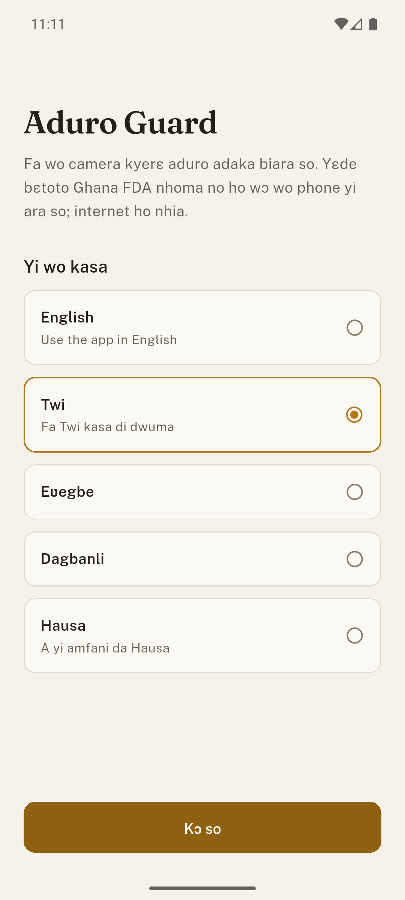
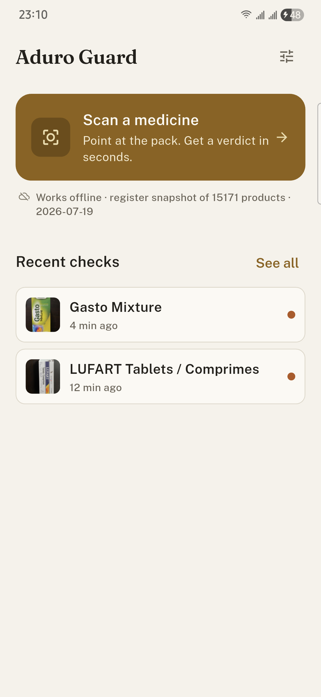
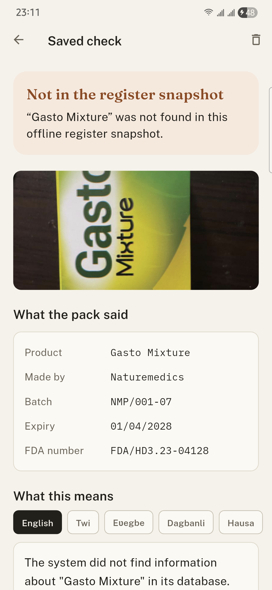
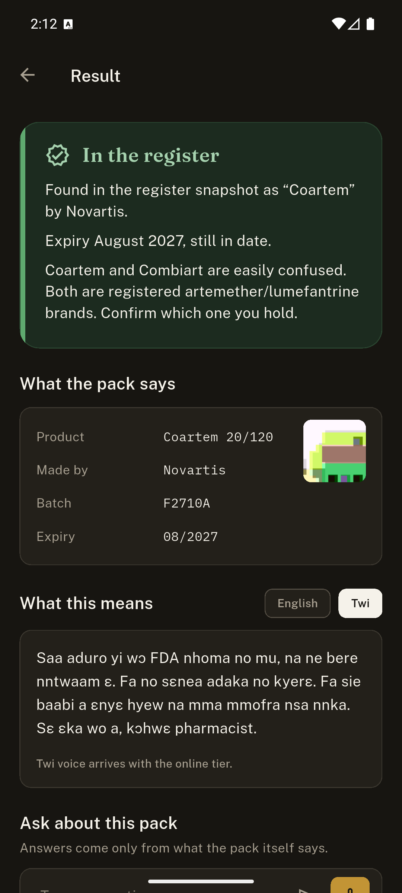
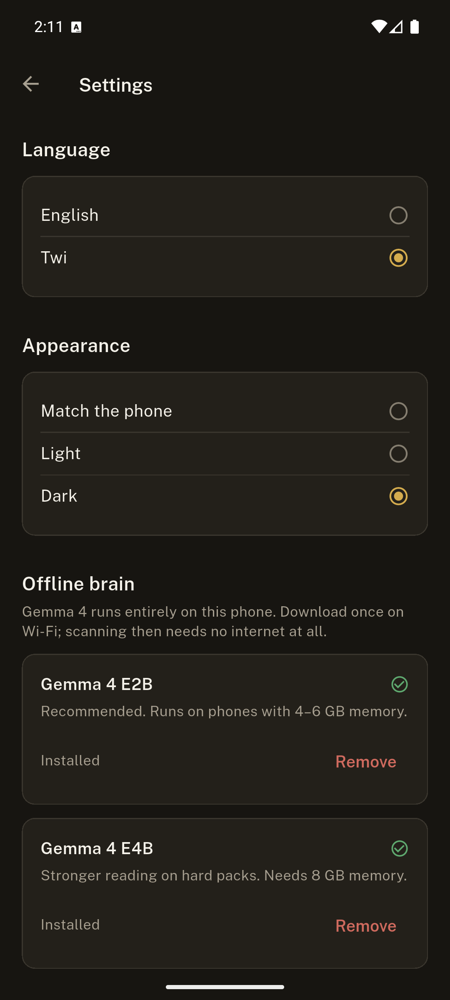

# Aduro Guard

Check any medicine before you take it. Offline, in seconds, in English or Twi.

Aduro means medicine in Twi. Aduro Guard is a camera-first medicine safety scanner built
for the [Build with Gemma: Ghana](https://www.kaggle.com/competitions/build-with-gemma-ghana)
hackathon. Point an ordinary Android phone at any medicine package: Gemma 4 reads the pack
with its eyes, an offline copy of the Ghana FDA product register decides the verdict, and
Gemma explains the result in plain English or Twi, out loud. Afterwards you can ask
follow-up questions by voice, and the answers come only from what the pack itself says.

Falsified and substandard medicines are linked to an estimated half a million deaths a
year in sub-Saharan Africa (WHO). Ghana's existing defense, scratch-code SMS checks, only
covers manufacturers who opt in. Aduro Guard reads any box ever printed. No barcode, no
code, no literacy requirement, no internet.

## Screenshots

| Onboarding in Twi | Home | Result | Dark result | Dark settings |
| --- | --- | --- | --- | --- |
|  |  |  |  |  |

## How it works: Gemma reads, the database decides, Gemma explains

```
┌──────────┐   photo    ┌─────────────────┐  strict JSON   ┌──────────────────┐
│  Camera  ├───────────►│  Gemma 4 E2B    ├───────────────►│  Verdict engine  │
└──────────┘            │  vision (OCR)   │ name, batch,   │  (pure Dart)     │
                        │  on-device      │ expiry, maker  │  FDA register    │
┌──────────┐   16kHz    │  LiteRT-LM      │                │  snapshot +      │
│   Mic    ├───────────►│  native audio   │◄───────────────┤  recall list +   │
└──────────┘  wav       │  understanding  │  verdict facts │  lookalike names │
                        └────────┬────────┘                └──────────────────┘
                                 │ counseling and grounded answers
                                 ▼
                        English / Twi text + device TTS
```

The model never invents a safety verdict. It extracts what is printed and phrases what
the database decided. Registered, expired, recalled, caution, and not-found are computed
by deterministic Dart code ([lib/services/verdict_engine.dart](lib/services/verdict_engine.dart))
with unit tests covering expiry formats, near-miss counterfeit spellings, and recall
precedence. A one-letter near-miss like "Pamadol" can never pass as "Panadol".

### Gemma 4 capabilities used, all on-device

| Capability | Where it works |
| --- | --- |
| Vision OCR | Pack photo to structured JSON extraction |
| Native audio input | Spoken follow-up questions, 16kHz WAV, no separate ASR stack |
| Multilingual generation | Counseling and answers in English, Twi, Ewe, Dagbani, and Hausa (the last three labelled early) |
| Edge inference | Gemma 4 E2B (2.4GB) via flutter_gemma and LiteRT-LM, GPU accelerated |

Speech out is offline too: English uses the device voice, and Twi, Ewe, and Hausa use
Meta MMS voices (open ONNX models, about 115 MB each) synthesized on-device with
sherpa-onnx. Each voice is an optional one-time download in Settings, the same pattern
as the Gemma model itself.

### Choosing the model

The default is Gemma 4 E2B, sized for the phones most Ghanaians actually carry (4 to 6 GB
of memory). Phones with 8 GB can switch to the stronger Gemma 4 E4B from Settings at any
time; both models are managed in the app with download progress, file import, and
removal. Inference is fully offline either way. The network is used once, for the model
download.

## Project layout

```
lib/
  theme/        design tokens and light/dark themes (see DESIGN.md, the design contract)
  models/       Product, Extraction, Verdict, ScanRecord
  services/     gemma (inference), verdict_engine (decisions), registry (snapshot),
                history, tts, prefs
  screens/      onboarding, home, scan, result, history, settings
  widgets/      verdict banner, counseling, follow-up, fact rows
tool/
  build_db.dart        compiles tool/data/*.tsv into assets/db/registry.db, with self-check
  scrape_register.py   full FDA register export, for when the public server is reachable
  data/                curated snapshot: real products, real FDA recalls, lookalike pairs
test/verdict_test.dart the safety logic's unit checks
docs/                  writeup draft and screenshots
```

## Running it

```sh
flutter pub get
dart run tool/build_db.dart      # rebuild the register snapshot (optional; committed)
flutter run                      # on an Android device (arm64), the real target
flutter run --dart-define=FAKE_GEMMA=true   # UI development without inference
```

First launch downloads Gemma 4 E2B (2.4GB, ungated, one time, Wi-Fi recommended), or you
can import the `.litertlm` file from Settings if you already have it. After that,
airplane mode changes nothing: scanning, verdicts, counseling, and voice questions are
fully offline.

## The register snapshot

The Ghana FDA's public register of 30,000+ products is served from
`fdaghana.gov.gh/product-register/`, and its backend is intermittently unreachable. The
committed snapshot is therefore a curated subset of real products compiled from FDA Ghana
public alerts, WHO medical product alerts, Ghana's essential medicines list, and common
registered brands, with a source recorded per row in
[tool/data/products.tsv](tool/data/products.tsv). The app labels it honestly as a
snapshot. When the server responds, `tool/scrape_register.py` exports the full register
and `tool/build_db.dart` folds it in automatically.

## Design

The visual rules live in [DESIGN.md](DESIGN.md) and the tokens in
[lib/theme/tokens.dart](lib/theme/tokens.dart): one gold brand ramp, warm tinted neutrals
in both light and dark themes, Fraunces for display type, Public Sans for text, IBM Plex
Mono for batch numbers and dates, and verdict colors reserved for verdicts. Appearance
follows the phone by default and can be pinned to light or dark in Settings.

## Languages and accessibility

The language picker labels every option in its own language, and choosing one flips the
whole interface immediately. UI chrome ships in English and Twi today; the Twi strings
live in one reviewable file ([lib/services/strings.dart](lib/services/strings.dart)) with
each translation beside its English source, and Ewe, Dagbani, and Hausa chrome falls back
to English until native speakers review translations. Content is in-language for all five.

The app works with screen readers: custom controls carry semantic labels and states, the
verdict is announced the moment it lands, decorative images are skipped, and touch
targets meet the 44dp minimum. The hold-to-talk mic always has a typed alternative for
switch-access users.

## Honest limits

- The snapshot is a subset, so "not found" always means verify, never fake.
- Twi output is code-switched everyday Twi. Ewe, Dagbani, and Hausa output is newer and
  labelled early support in the app.
- The MMS voices are intelligible rather than natural, and Dagbani has no published
  voice yet, so it ships as text only.
- Blister packs with tiny embossed dates can defeat OCR. The app asks for better light
  rather than guessing.

## License

Apache 2.0. Built with [flutter_gemma](https://pub.dev/packages/flutter_gemma), Gemma 4
(Google DeepMind), and data from FDA Ghana public notices.
