# Aduro Guard

Check any medicine before you take it. Offline, in seconds, in English or Twi.

Aduro means medicine in Twi. Aduro Guard is a camera-first medicine safety scanner built
for the [Build with Gemma: Ghana](https://www.kaggle.com/competitions/build-with-gemma-ghana)
hackathon. Point an ordinary Android phone at any medicine package: Gemma 4 reads the pack
with its eyes, an offline copy of the Ghana FDA product register decides the verdict, and
Gemma explains the result in plain English or Twi, out loud. Afterwards you can ask
follow-up questions by voice, and the answers come only from what the pack itself says.

Falsified and substandard medicines are linked to an estimated half a million deaths a
year in sub-Saharan Africa (WHO). Ghana's existing defense, scratch-code SMS checks, only
covers manufacturers who opt in. Aduro Guard reads any box ever printed. No barcode, no
code, no literacy requirement, no internet.

## Screenshots

Captured in sequence on a Galaxy S24 running the release build, with Gemma 4 E2B doing the
reading on the phone. Files are numbered in the order they were taken, in
[docs/screenshots/](docs/screenshots/).

**Setup, once.** Every language labels itself, and choosing one flips the whole interface
immediately. Then the model is downloaded or imported, and after that the app never needs
a network.

| Language picker | The same screen in Gã | …and in Twi | Offline brain | Downloading |
| --- | --- | --- | --- | --- |
| 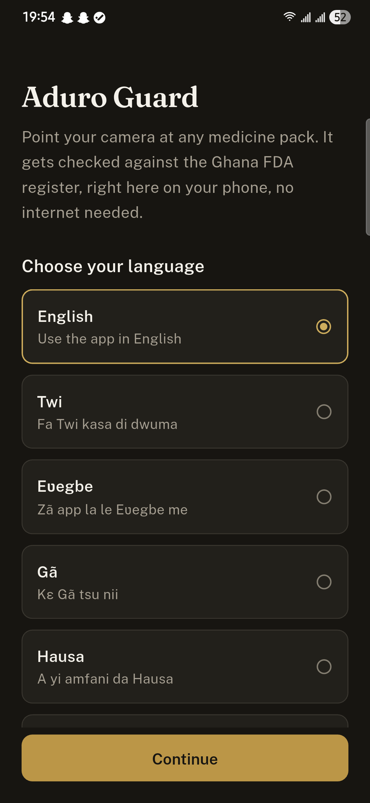 | 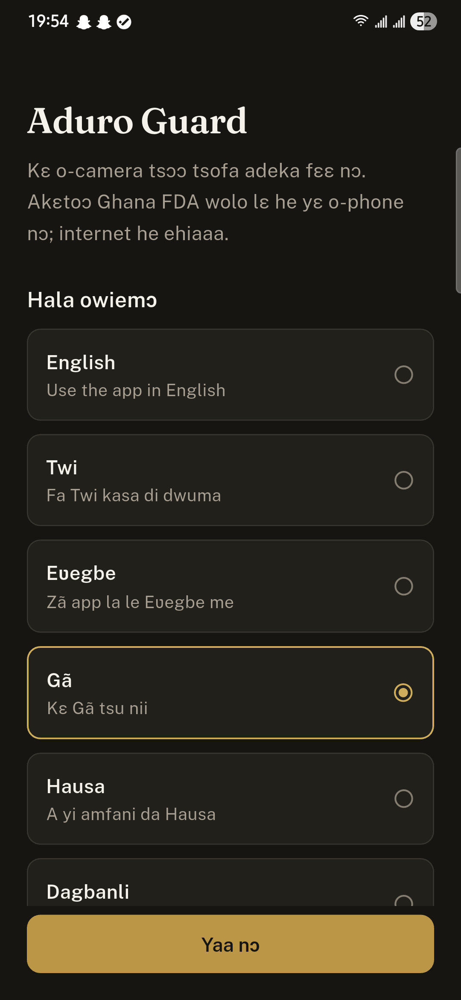 | 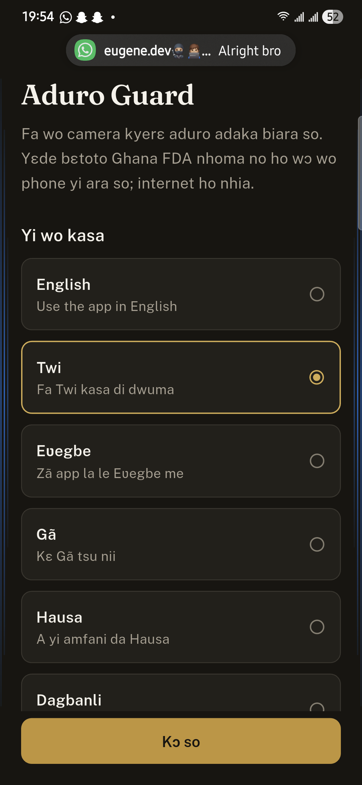 | 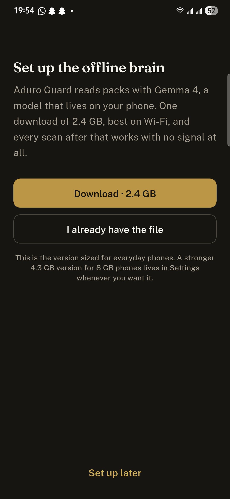 | 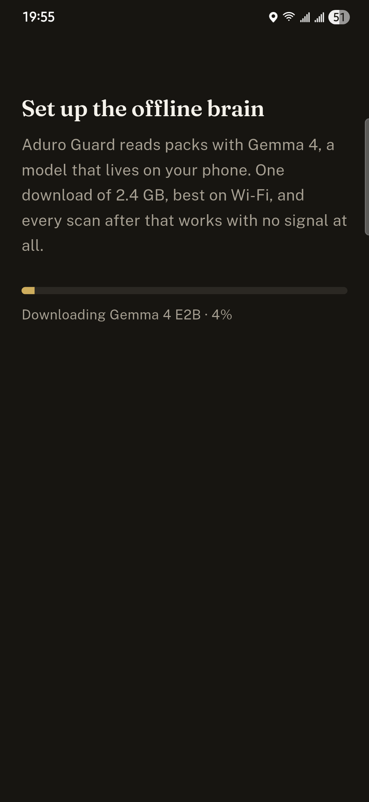 |

**Scanning.** Point, confirm, and the pack is read on the phone.

| Home | Camera | Confirm | Reading, offline |
| --- | --- | --- | --- |
| 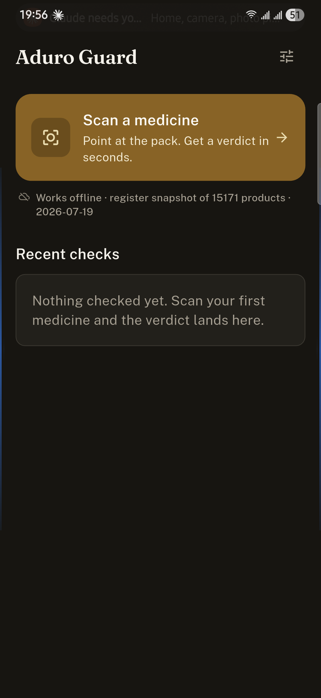 | 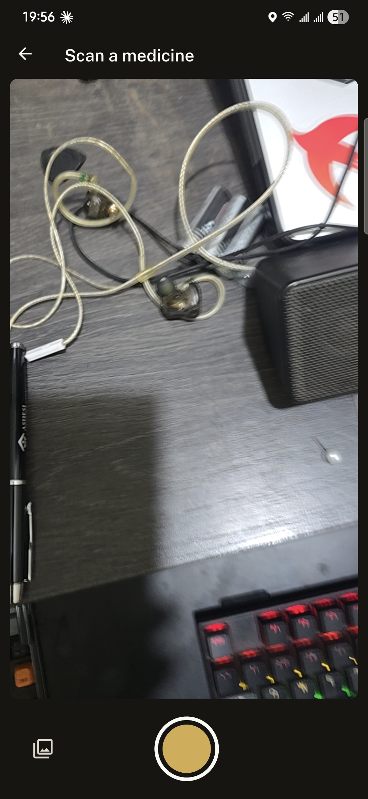 | 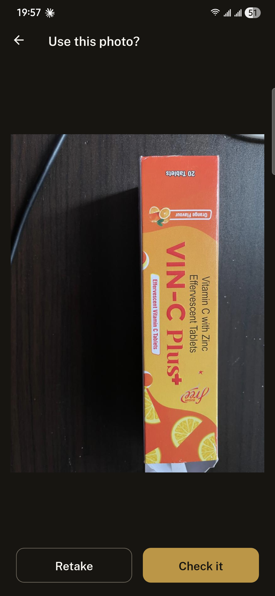 | 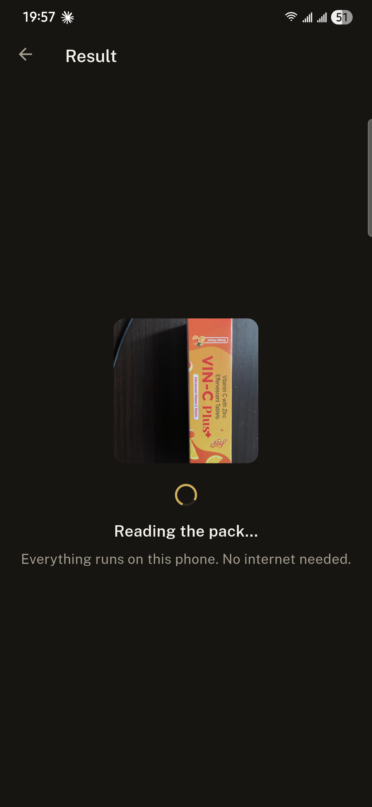 |

**One photo rarely shows everything.** The name is on the front while batch and expiry
hide on a side panel. Rather than instruct anyone up front, the app waits until it has a
verdict, names exactly what it could not see, and offers one button for another angle.

| After one photo: batch, expiry and maker unread | After a photo of the back |
| --- | --- |
| 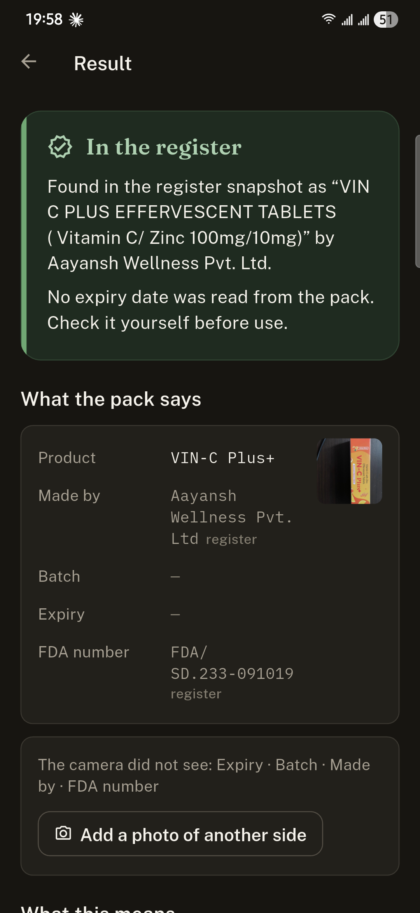 | 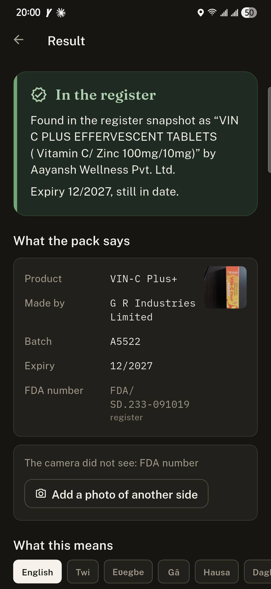 |

**Guidance, in your language.** Twi and Gã here are reviewed wording with the scan's own
expiry date filled in, shown because the model cannot be trusted to hold those languages.

| English | Twi | Gã |
| --- | --- | --- |
| 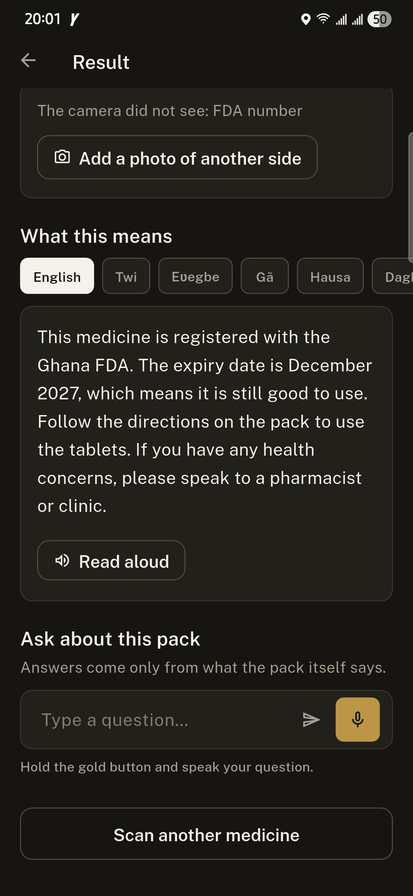 | 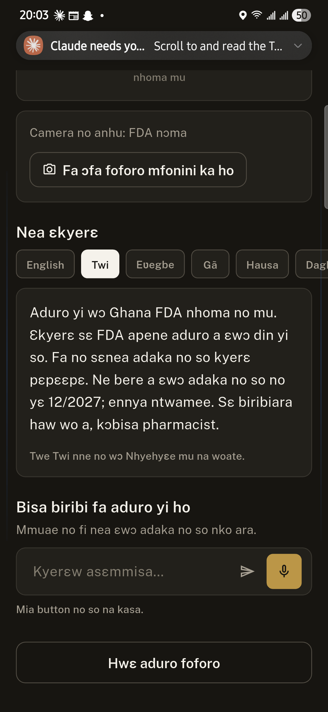 | 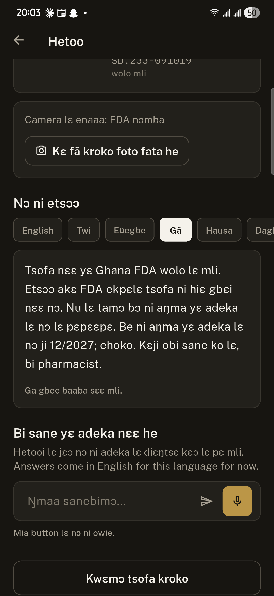 |

**Ask about the pack, and it stays.** Answers come only from the pack's own text, so a
question it cannot answer gets a referral rather than a guess. The thread is saved with
the scan.

| Asking during a scan | The same thread in a saved check |
| --- | --- |
| 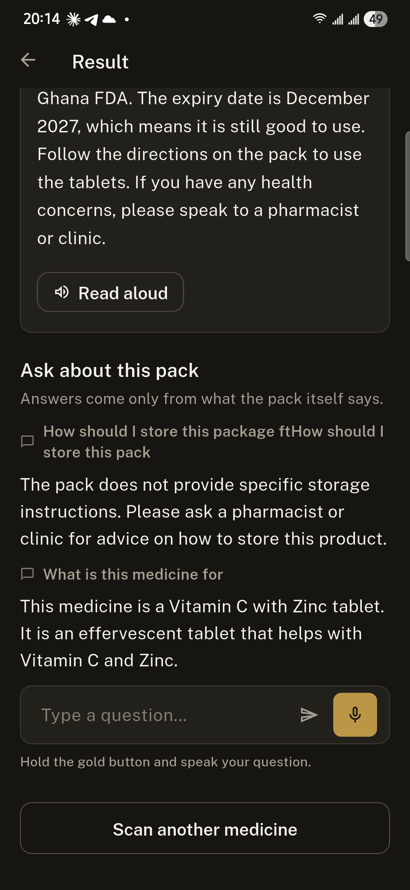 | 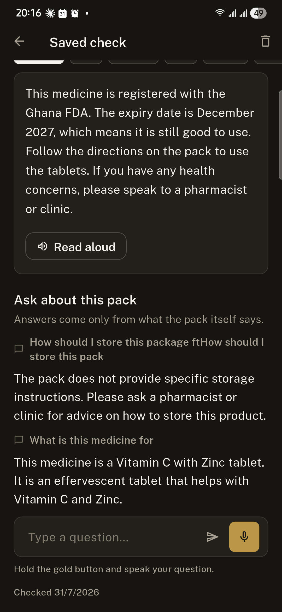 |

| Home with a check | History | Settings | Offline voices |
| --- | --- | --- | --- |
| 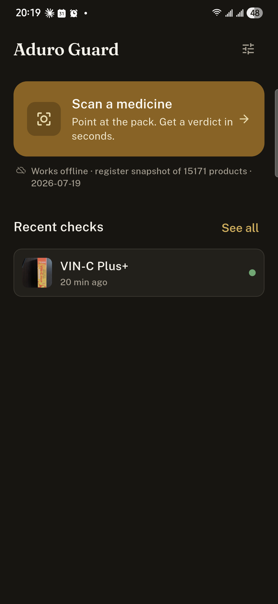 |  | 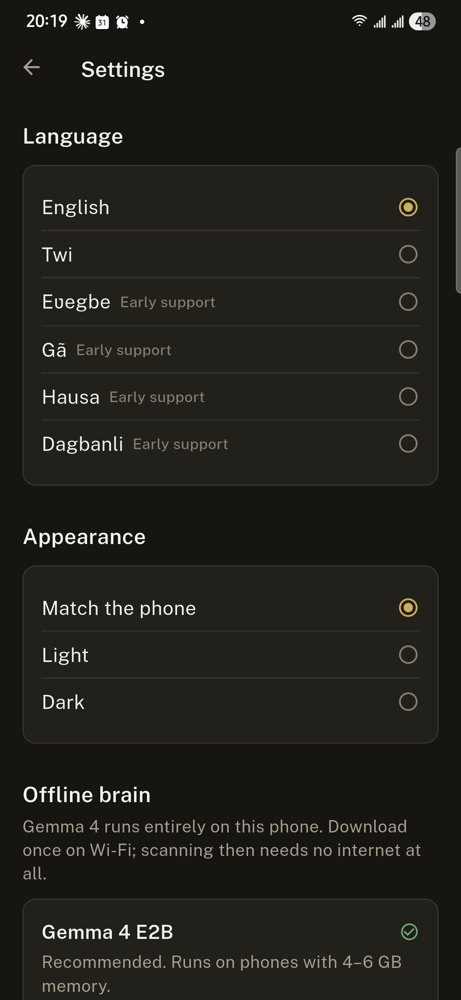 | 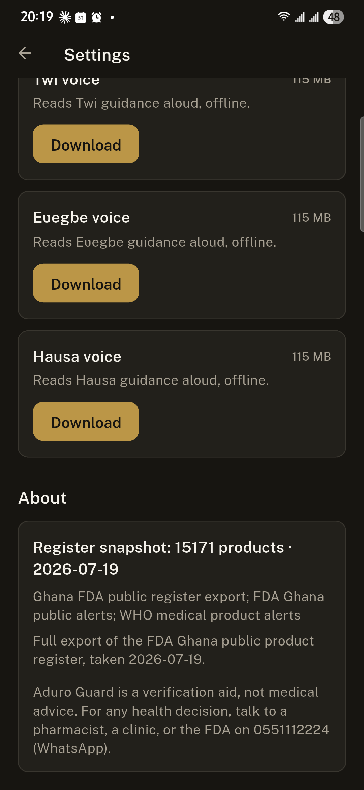 |

## How it works: Gemma reads, the database decides, Gemma explains

```
┌──────────┐   photo    ┌─────────────────┐  strict JSON   ┌──────────────────┐
│  Camera  ├───────────►│  Gemma 4 E2B    ├───────────────►│  Verdict engine  │
└──────────┘            │  vision (OCR)   │ name, batch,   │  (pure Dart)     │
                        │  on-device      │ expiry, maker  │  FDA register    │
┌──────────┐   16kHz    │  LiteRT-LM      │                │  snapshot +      │
│   Mic    ├───────────►│  native audio   │◄───────────────┤  recall list +   │
└──────────┘  wav       │  understanding  │  verdict facts │  lookalike names │
                        └────────┬────────┘                └──────────────────┘
                                 │ counseling and grounded answers
                                 ▼
                        English / Twi text + device TTS
```

The model never invents a safety verdict. It extracts what is printed and phrases what
the database decided. Registered, expired, recalled, caution, and not-found are computed
by deterministic Dart code ([lib/services/verdict_engine.dart](lib/services/verdict_engine.dart))
with unit tests covering expiry formats, near-miss counterfeit spellings, and recall
precedence. A one-letter near-miss like "Pamadol" can never pass as "Panadol".

### Gemma 4 capabilities used, all on-device

| Capability | Where it works |
| --- | --- |
| Vision OCR | Pack photo to structured JSON extraction |
| Native audio input | Spoken follow-up questions, 16kHz WAV, no separate ASR stack |
| Multilingual generation | Counseling and answers in English, Twi, Ewe, Dagbani, and Hausa (the last three labelled early) |
| Edge inference | Gemma 4 E2B (2.4GB) via flutter_gemma and LiteRT-LM, GPU accelerated |

Speech out is offline too: English uses the device voice, and Twi, Ewe, and Hausa use
Meta MMS voices (open ONNX models, about 115 MB each) synthesized on-device with
sherpa-onnx. Each voice is an optional one-time download in Settings, the same pattern
as the Gemma model itself.

### Choosing the model

The default is Gemma 4 E2B, sized for the phones most Ghanaians actually carry (4 to 6 GB
of memory). Phones with 8 GB can switch to the stronger Gemma 4 E4B from Settings at any
time; both models are managed in the app with download progress, file import, and
removal. Inference is fully offline either way. The network is used once, for the model
download.

## Project layout

```
lib/
  theme/        design tokens and light/dark themes (see DESIGN.md, the design contract)
  models/       Product, Extraction, Verdict, ScanRecord
  services/     gemma (inference), verdict_engine (decisions), registry (snapshot),
                history, tts, prefs
  screens/      onboarding, home, scan, result, history, settings
  widgets/      verdict banner, counseling, follow-up, fact rows
tool/
  build_db.dart        compiles tool/data/*.tsv into assets/db/registry.db, with self-check
  scrape_register.py   full FDA register export (resumable, polite paging)
  data/                register export + curated FDA recalls, alerts, lookalike pairs
test/verdict_test.dart the safety logic's unit checks
docs/                  writeup draft and screenshots
```

## Running it

```sh
flutter pub get
dart run tool/build_db.dart      # rebuild the register snapshot (optional; committed)
flutter run                      # on an Android device (arm64), the real target
flutter run --dart-define=FAKE_GEMMA=true   # UI development without inference
```

First launch downloads Gemma 4 E2B (2.4GB, ungated, one time, Wi-Fi recommended), or you
can import the `.litertlm` file from Settings if you already have it. After that,
airplane mode changes nothing: scanning, verdicts, counseling, and voice questions are
fully offline.

## The register snapshot

**Source: https://verifypermit.fdaghana.gov.gh/publicsearch**, the Ghana FDA's own public
product register. Three quirks to know before you click: it answers over **https only**
(the plain-HTTP site on port 80 returns 404, so typing the bare domain into a browser
shows "Not Found"), its TLS certificate has been expired since September 2025 (your
browser will warn; the scraper skips verification for exactly that reason), and the
service is intermittently unreachable. All of which is precisely why carrying a copy on
the phone matters.

[tool/scrape_register.py](tool/scrape_register.py) pages through that endpoint (resumable,
one second between requests) and writes every row to TSV.
[tool/build_db.dart](tool/build_db.dart) compiles it into `assets/db/registry.db` and
merges a curated layer of real FDA Ghana recall and safety alerts, WHO medical product
alerts, and lookalike name pairs ([tool/data/](tool/data/)). The committed snapshot is
**16,454 exported rows, 15,171 unique products** with registration numbers, generics and
manufacturers, taken **2026-07-19**.

To refresh it:

```sh
python3 tool/scrape_register.py     # re-export from the FDA endpoint
dart run tool/build_db.dart         # rebuild the snapshot, with self-checks
```

The app labels the result honestly as a dated snapshot, so "not found" always reads as
verify, never as fake.

## Design

The visual rules live in [DESIGN.md](DESIGN.md) and the tokens in
[lib/theme/tokens.dart](lib/theme/tokens.dart): one gold brand ramp, warm tinted neutrals
in both light and dark themes, Fraunces for display type, Public Sans for text, IBM Plex
Mono for batch numbers and dates, and verdict colors reserved for verdicts. Appearance
follows the phone by default and can be pinned to light or dark in Settings.

## Languages, voices, and speech

Six languages: English, Twi, Ewe (Eʋegbe), Ga (Gã), Hausa, and Dagbani (Dagbanli). The
picker labels every option in itself, and choosing one flips the whole interface
immediately. Every translation lives beside its English source in one reviewable file
([lib/services/strings.dart](lib/services/strings.dart)); anything untranslated falls
back to English rather than guess. Ga is the newest set and the least reviewed.

**How each language gets its counseling.** Gemma 4 E2B holds English, Twi and Hausa, so
those generate live, and every generation is verified: a cycle detector catches
repetition collapse, and a function-word heuristic catches English prose under a
local-language heading. Failures are replaced by reviewed wording in
[lib/services/counseling.dart](lib/services/counseling.dart), six verdicts per language
with slots that carry the scan's own facts (the actual expiry date read off the pack).
Ewe, Ga and Dagbani skip generation entirely, because on-device testing showed the model
answers them in English every time; they read the reviewed wording directly. The
follow-up chat follows the same split: English, Twi and Hausa chat in-language, and the
other three get English answers with the UI saying so plainly, since free-form Q&A has no
reviewed fallback to swap in.

**Text to speech** is offline. English uses the phone's own voice via `flutter_tts`.
Twi, Ewe and Hausa use Meta's open MMS voices (VITS models from the Massively
Multilingual Speech project, CC BY-NC 4.0), taken as community ONNX exports
([willwade/mms-tts-multilingual-models-onnx](https://huggingface.co/willwade/mms-tts-multilingual-models-onnx),
about 115 MB per language: `aka` for Twi, `ewe`, `hau`), each an optional one-time
download in Settings and synthesized on-device by `sherpa_onnx` in a persistent warm
worker isolate.

Ga and Dagbani ship text-only. No open TTS model exists for Ga at all, in MMS or
anywhere else we could find. Dagbani does have one, GhanaNLP's VITS checkpoint, and
[tool/export_vits_onnx.py](tool/export_vits_onnx.py) converts it far enough to load in
sherpa-onnx but not far enough to synthesize. [docs/voices.md](docs/voices.md) records
exactly where it stops and what closing the gap needs.

**Speech to text does not exist as a separate system.** Spoken follow-up questions are
16kHz mono WAV from the `record` package fed straight into Gemma 4's native audio
understanding; there is no ASR model, no transcript step, and nothing extra to download.

The app works with screen readers: custom controls carry semantic labels and states, the
verdict is announced the moment it lands, decorative images are skipped, and touch
targets meet the 44dp minimum. The hold-to-talk mic always has a typed alternative for
switch-access users.

## Honest limits

- The snapshot is dated the day it was exported, so "not found" always means verify,
  never fake.
- Twi output is code-switched everyday Twi. Ewe, Ga, Dagbani, and Hausa are newer and
  labelled early support in the app; all the local-language wording awaits native review.
- The MMS voices are intelligible rather than natural, and Ga and Dagbani have no
  published voice yet, so they ship as text only.
- Blister packs with tiny embossed dates can defeat OCR. The app asks for better light
  rather than guessing.

## License

Apache 2.0. Built with [flutter_gemma](https://pub.dev/packages/flutter_gemma), Gemma 4
(Google DeepMind), and data from FDA Ghana public notices.
